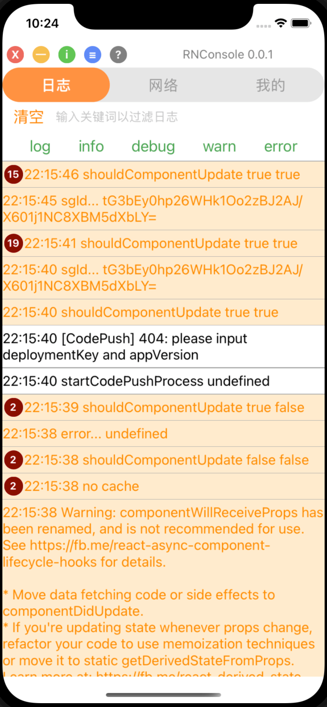
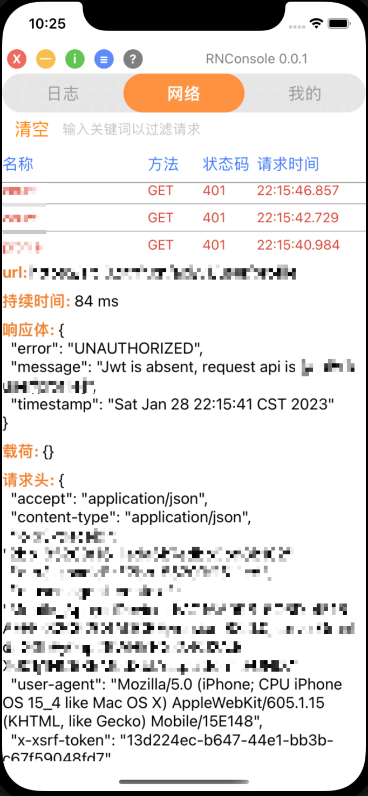
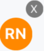
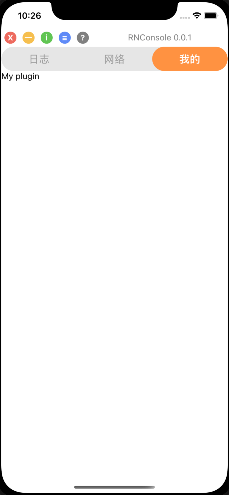

# rnconsole

react-native 版本的[vConsole](https://github.com/Tencent/vConsole)

---

## 功能

- JS 日志: `console.log|info|error|...`
- JS 网络请求: `XMLHttpRequest`
- 自定义插件

## 快速入门

- 注意：该库引入`valtio`和`react-native-device-info`作为`peerDependencies`，宿主项目需要确保安装了这些依赖
  ```json
  "peerDependencies": {
    "react": "16.9.0",
    "react-native": "0.61.4",
    "react-native-device-info": "^10.3.0",
    "valtio": "^1.9.0"
  }
  ```
- 安装依赖
  ```bash
  npm i rnconsole
  # 或yarn
  yarn add rnconsole
  # 或pnpm
  pnpm add rnconsole
  ```
- 引入`RNConsoleComponent`即可

  ```tsx
  import { RNConsoleComponent } from 'rnconsole'

  ...
  <RNConsoleComponent />
  ...
  ```
  

- 图标功能说明：

  |                             图标                             |      功能      |
  | :----------------------------------------------------------: | :------------: |
  |  |    隐藏面板    |
  |  |   最大化面板   |
  |  |   最小化面板   |
  |  | 打开系统信息页 |
  |  |   打开设置页   |
  |  |   打开帮助页   |

  


## API

- 若需要手动控制`RNConsoleComponent`的可见性，可通过`RNConsole.instance?.showSwitch()/hideSwitch()`控制。此外，还可通过在`RNConsoleComponent`上设置`withCloseButton`属性给予入口处一个关闭按钮：

  ```tsx
  // 展示RNConsole入口
  RNConsole.instance?.showSwitch()
  // 隐藏RNConsole入口
  RNConsole.instance?.hideSwitch()

  ...
  <RNConsoleComponent withCloseButton={true} />
  ...
  ```
  

- 若需要添加自定义插件，需要先实例化`RNConsolePlugin`并传入插件 ID 及插件名称；若插件需要展示面板，则要添加`renderTab`事件，并在回调函数中渲染面板组件；最后再添加插件实例：

  ```tsx
  import { IRNConsolePluginEvent, RNConsole, RNConsolePlugin } from "rnconsole";
  
  const MyPlugin = () => <Text>My plugin</Text>;
  const myPlugin = new RNConsolePlugin("myPlugin", "我的");
  myPlugin.on("renderTab", (render: IRNConsolePluginEvent) => render(MyPlugin));
  RNConsole.instance?.addPlugin(myPlugin);
  ```
  

## 开发

- 使用 npm7+进行依赖安装，否则 peerDependencies 无法自动安装

  ```bash
  npm i
  ```

- 通过 Rollup 进行构建并监听变动：

  ```bash
  npm run dev
  ```

- React Native 无法使用 symlinks 进行调试，需要借助[wml](https://github.com/wix/wml)：

  ```bash
  npm i -g wml
  # add the link to wml using `wml add <src> <dest>`
  wml add ~/my-package ~/main-project/node_modules/my-package
  # start watching all links added
  npm run wml
  ```

- MacOS 首次运行 wml 需要先执行：

  ```shell
  watchman watch /usr/local/lib/node_modules/wml/src
  ```

- Windows 首次运行 wml 需要先执行：

  ```shell
  # npmGlobalPrefix 可以通过 `npm prefix -g` 获取
  $ watchman watch ${npmGlobalPrefix}\node_modules\wml\src
  # 一定要重启电脑让配置生效！
  ```

- 修改 `.watchmanconfig` 之后需要清空 watchman 缓存：`npm run wml:clean`
